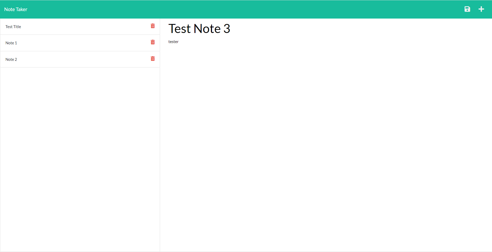

# Note-Taker

## Purpose

This application allows users to create and save tasks. The purpose of this application is so users have a basic task manager application for convenience.

## Built with 
    *   HTML
    *   CSS
    *   Bootstrap
    *   Javascript
    *   node.js
    *   express.js
    *   APIs

## Application Link

https://note-taker-challenge11.herokuapp.com/

## Screenshot of my application

## Created by:

Bryan Cifuentes-Escobar